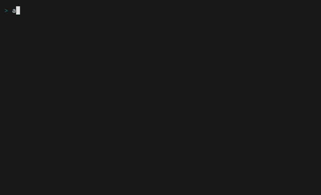

# a3d

[](https://github.com/heiervang-technologies/a3d.rs/actions/workflows/rust-ci.yml)
[](LICENSE)

GPU-accelerated ASCII 3D rendering engine written in Rust.

Renders 3D models (OBJ, STL) as real-time ASCII art in your terminal, using wgpu compute shaders (Vulkan) for rasterization and glam for SIMD-accelerated math.

Inspired by [voxcii](https://github.com/ashish0kumar/voxcii), rebuilt from scratch in Rust for memory safety, performance, and extensibility.



> Recorded with [VHS](https://github.com/charmbracelet/vhs) from `assets/demo.tape` — `a3d models/dog.stl --color --fg 00ddff`.

## Features

- Real-time 3D rendering with ASCII shading
- Z-buffered scanline triangle rasterization with plane-equation depth interpolation
- Orthographic projection with terminal aspect-ratio correction
- OBJ format support (with MTL material colors)
- STL format support (binary and ASCII)
- Auto-rotation with golden ratio oscillation
- Interactive mode (arrow keys + zoom)
- Automatic terminal resize handling
- Aspect ratio correction for non-square terminal characters
- wgpu GPU context initialization (Vulkan backend)

## Requirements

- Rust 1.85+ (2024 edition)
- A Vulkan-capable GPU with 64-bit atomic min/max (`VK_KHR_shader_atomic_int64`)
  for GPU rendering; without it a3d transparently falls back to the CPU renderer
- A terminal emulator

### Arch Linux

```bash
sudo pacman -S vulkan-icd-loader vulkan-headers
# For NVIDIA:
sudo pacman -S nvidia nvidia-utils
# For AMD:
sudo pacman -S vulkan-radeon
```

## Installation

```bash
git clone https://github.com/heiervang-technologies/a3d.rs.git
cd a3d.rs
cargo build --release
```

The binary will be at `target/release/a3d`.

## Usage

```bash
# Auto-rotating model (default)
a3d model.obj

# Interactive mode
a3d model.obj --interactive

# With ANSI true color
a3d model.obj --color

# Custom FPS and zoom
a3d model.obj --fps 60 --zoom 2.5
```

### CLI Options

| Option | Short | Default | Description |
|--------|-------|---------|-------------|
| `<MODEL>` | | (required) | Path to OBJ or STL file |
| `--fps` | `-f` | 30 | Target frames per second |
| `--interactive` | `-i` | off | Manual rotation with arrow keys |
| `--zoom` | `-z` | 1.0 | Initial zoom level |
| `--color` | `-c` | off | Enable ANSI 24-bit true color output |
| `--gpu` | | auto | Force GPU rendering (error if no adapter) |
| `--cpu` | | auto | Force CPU rendering |
| `--fg` | | model | Foreground color as hex, e.g. `ff6600` (implies `--color`) |
| `--bg` | | none | Background color as hex, e.g. `1a1a2e` (implies `--color`) |

By default a3d uses the GPU when an adapter is available and falls back to the CPU rasterizer otherwise.

### Controls (interactive mode)

| Key | Action |
|-----|--------|
| Arrow keys / `hjkl` | Rotate model |
| Scroll wheel | Zoom in/out |
| `+` / `=` | Zoom in |
| `-` | Zoom out |
| `c` | Toggle color on/off |
| `q` / `Esc` | Quit |

### Debug logging

```bash
RUST_LOG=info a3d model.obj
```

## Development

```bash
cargo test                # unit tests + CPU snapshot regression + GPU comparison
cargo clippy --all-targets --all-features -- -D warnings
cargo fmt --all
```

- **`gpu_compare`** renders the same scene on the CPU and GPU and asserts they
  match; it skips automatically when no GPU adapter is present, so the suite is
  green on GPU-less machines.
- **Regenerate the CPU snapshots** after an intentional rendering change:
  ```bash
  cargo test --test gen_snapshots -- --ignored
  ```
- **Re-record the demo GIF** (requires [VHS](https://github.com/charmbracelet/vhs)
  + ffmpeg; see the optimization note in `assets/demo.tape`):
  ```bash
  vhs assets/demo.tape
  ```

CI runs `fmt --check`, `clippy -D warnings`, build, and the full test suite on
every pull request.

## Architecture

```
src/
├── main.rs              # Render loop, CLI, CPU rasterizer
├── gpu/
│   ├── context.rs       # wgpu device/queue/adapter initialization
│   ├── pipeline.rs      # GPU compute pipeline (3-pass: transform → depth → shade)
│   └── raster.wgsl      # Compute shader entry points
├── model/
│   ├── loader.rs        # OBJ and STL file parsing
│   └── mesh.rs          # Vertex/Mesh types, normalization
├── render/
│   ├── ascii.rs         # ASCII luminance ramp mapping
│   ├── camera.rs        # Orbital camera with perspective projection
│   └── framebuffer.rs   # Depth buffer + character grid
└── terminal/
    └── display.rs       # crossterm terminal rendering + input
```

### Rendering Pipeline

```
Model file (OBJ/STL)
    │
    ▼
Load & parse ──▶ Normalize to [-1, 1]
    │
    ▼
┌─────────── Render Loop (30 FPS) ───────────┐
│                                             │
│  Clear framebuffer (depth = ∞)              │
│       │                                     │
│       ▼                                     │
│  For each triangle:                         │
│    ├─ Compute face normal (cross product)   │
│    ├─ Directional lighting (dot product)    │
│    ├─ Map luminance → ASCII char            │
│    ├─ Project vertices (orthographic)       │
│    └─ Rasterize with z-buffer               │
│       │                                     │
│       ▼                                     │
│  Render to terminal (crossterm)             │
│       │                                     │
│       ▼                                     │
│  Handle input / frame-rate limit            │
└─────────────────────────────────────────────┘
```

### ASCII Luminance Ramp

Surface brightness maps to characters from dark to bright:

```
 . , ' : ; ! + * = # $ @
◄─── dark              bright ───►
```

Luminance is computed as `dot(-face_normal, light_direction) * 0.5 + 0.5`, giving a [0, 1] range that indexes into this 12-character ramp.

## Tech Stack

| Concern | Crate | Purpose |
|---------|-------|---------|
| GPU compute | `wgpu` | Vulkan compute shaders for rasterization |
| CPU math | `glam` | SIMD-accelerated vectors and matrices |
| Terminal | `crossterm` | Raw mode, cursor control, input events |
| OBJ loading | `tobj` | Wavefront OBJ + MTL parsing |
| STL loading | `stl_io` | Binary and ASCII STL parsing |
| CLI | `clap` | Argument parsing with derive macros |
| GPU data | `bytemuck` | Safe transmutes for GPU buffer data |
| Logging | `log` + `env_logger` | Debug and info logging |

## Roadmap

See [Issue #1](https://github.com/heiervang-technologies/a3d.rs/issues/1) for the full roadmap including:

- **M1:** Core rendering MVP ✅
- **M2:** GPU compute pipeline (wgpu shaders) ✅
- **M3:** Advanced rendering (Phong lighting, shadows, color) — current
- **M4:** Scene graph and animation
- **M5:** Performance and polish
- **M6:** Extensions (WASM, export, plugins)

## Acknowledgements

- Inspired by [voxcii](https://github.com/ashish0kumar/voxcii) by ashish0kumar.
- The bundled sample mesh `models/dog.stl` is the author's own model. See
  [`models/README.md`](models/README.md) for details.

## Contributing

Contributions are welcome — see [CONTRIBUTING.md](CONTRIBUTING.md) and our
[Code of Conduct](CODE_OF_CONDUCT.md). Security issues: please follow
[SECURITY.md](SECURITY.md).

## License

a3d is licensed under the [MIT License](LICENSE). This covers both the source
code and the bundled sample model (`models/dog.stl`), which is the author's own
work — see [`models/README.md`](models/README.md).
